# AMap Smart Route Planner

一款基于 Java 与高德地图 Android SDK 的多途径点智能路线规划应用。项目面向真实出行场景，将地点采集、启发式途径点排序、周边 POI 推荐、多方式路线规划和路线收藏串成完整工作流，并通过最近邻启发式 TSP 排序展示路径规划算法在移动端应用中的落地。

## 主要功能

- 地图浏览：标准图、卫星图、夜间图、实时路况、自定义缩放与定位。
- 地点采集：支持 POI 关键字搜索、搜索提示和地图点选。
- 途径点管理：选择、删除、拖拽排序，并用最近邻启发式算法优化访问顺序。
- 智能推荐：以途径点为圆心，按自定义半径和 POI 类型执行范围搜索并绘制缓冲区。
- 路线规划：支持驾车、步行、骑行、公交、货车和电动车策略。
- 路线详情：展示总里程、预计时间、出行方式和途径点数量。
- 路线收藏：使用 SharedPreferences 与 Gson 在本地保存、浏览、重命名和删除路线。

## 路径规划算法

### 多途径点访问顺序优化

对用户选择的多个途径点，项目使用最近邻（Nearest Neighbor）启发式算法生成访问顺序的初始解：

1. 从当前点出发；
2. 在尚未访问的途径点中选择距离最近的点；
3. 将该点加入访问序列并继续迭代；
4. 直到所有途径点均被访问。

点间距离使用 Haversine 公式计算球面距离。对于 \(N\) 个途径点，当前实现的时间复杂度约为 \(O(N^2)\)。

核心实现位于：

```text
app/src/main/java/cn/edu/gzhu/amap/TspOptimizer.java
```

该算法用于快速生成可用的多途径点访问顺序，是启发式 baseline，并不声称得到精确 TSP 全局最优解。排序完成后，应用再调用高德地图 SDK 执行不同交通方式下的实际路线规划与可视化。

## 界面预览

### 核心页面

| 地图浏览 | 智能路线规划 | 路线收藏 |
| --- | --- | --- |
| 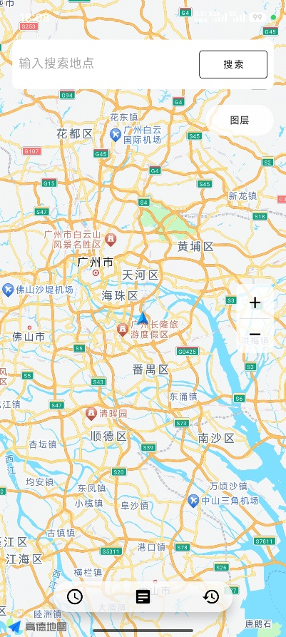 | 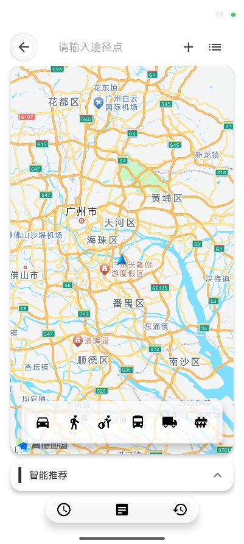 | 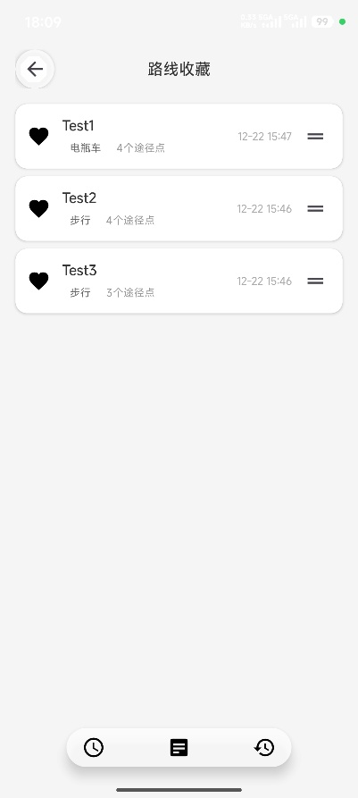 |

### 地点采集与途径点管理

| POI 搜索 | 地图选点 | 删除途径点 |
| --- | --- | --- |
| 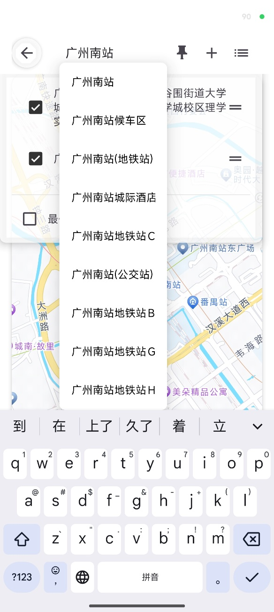 | 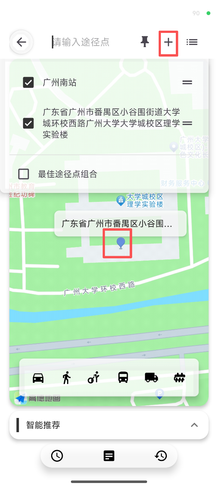 | 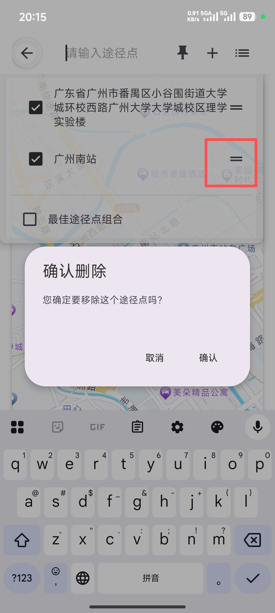 |

| 拖拽排序 | 路径顺序优化 | 优化结果 |
| --- | --- | --- |
| 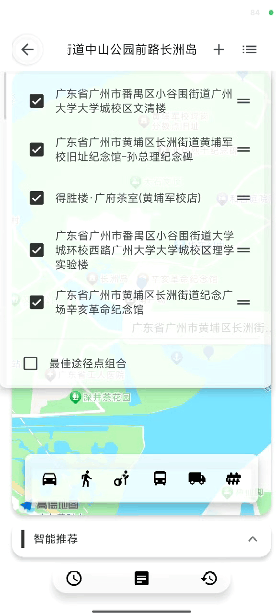 | 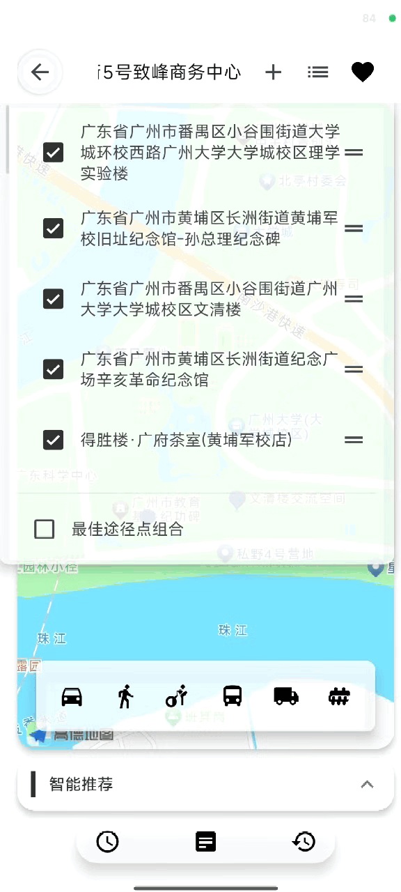 | 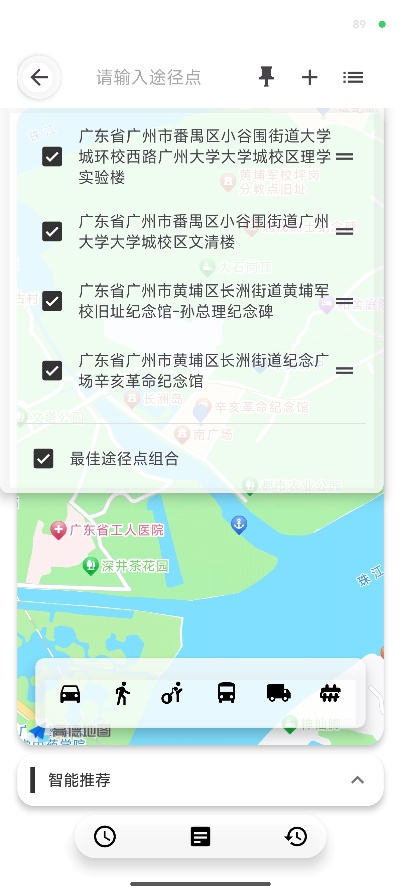 |

### 智能推荐

| 操作过程 | 缓冲区与 POI 结果 |
| --- | --- |
| 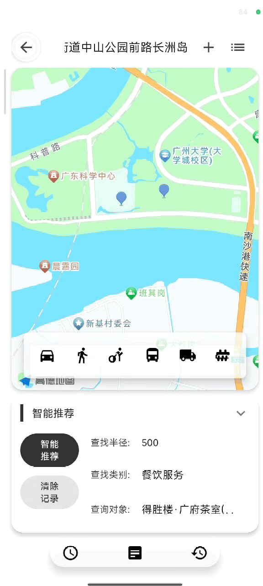 | 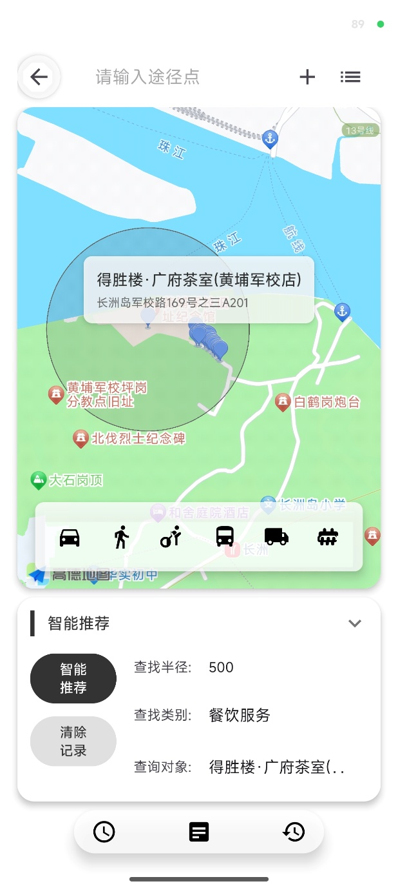 |

### 多方式路线与路线详情

| 步行路线 | 电动车路线 | 步行详情 |
| --- | --- | --- |
| 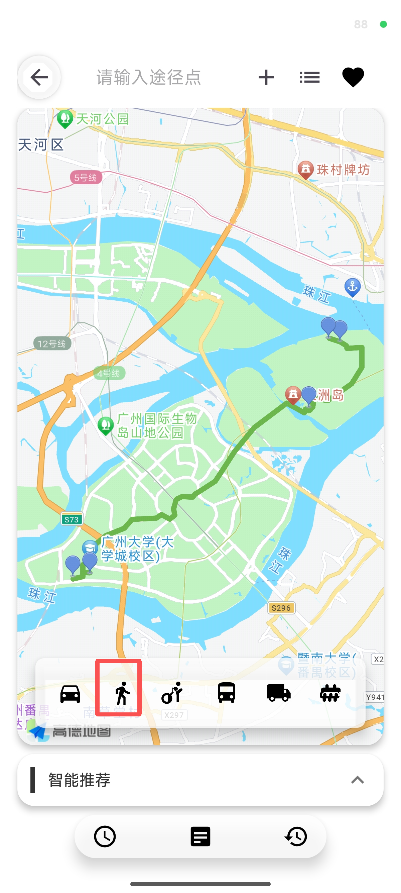 | 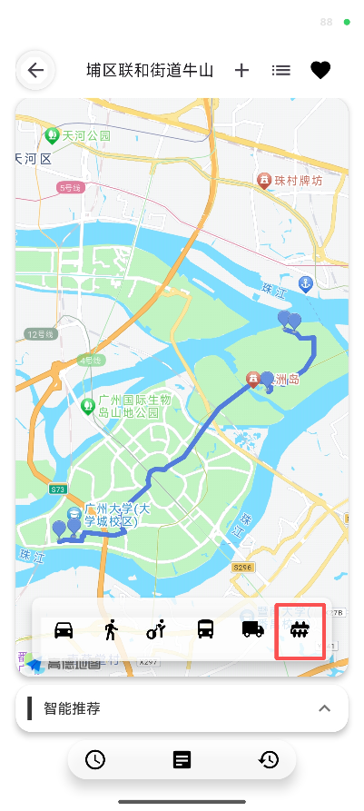 | 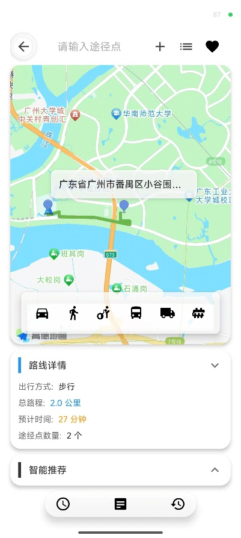 |

| 骑行详情 | 公交详情 | 收藏路线 |
| --- | --- | --- |
| 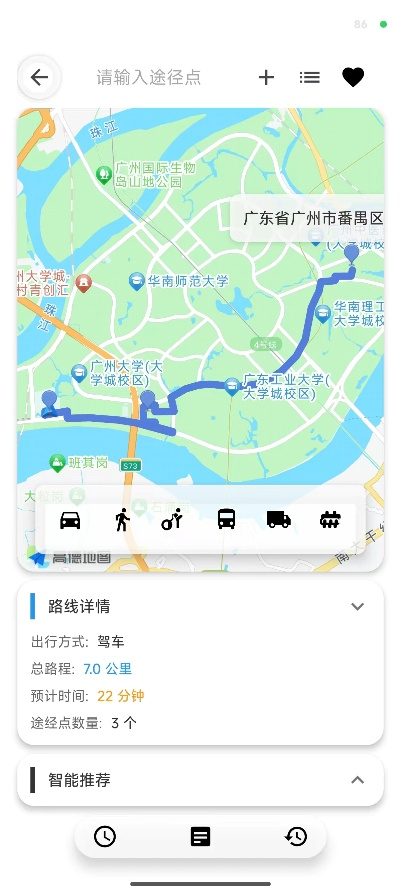 | 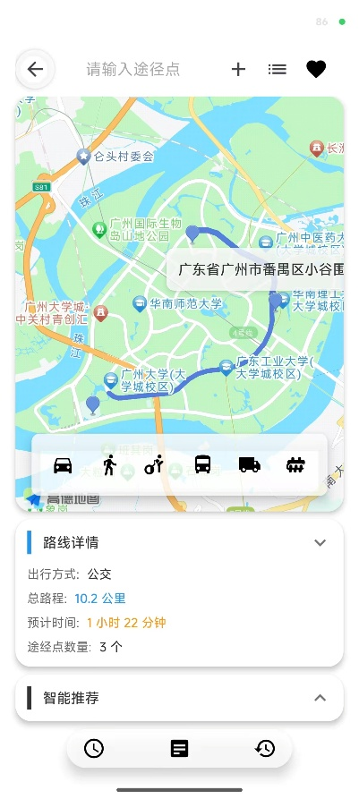 | 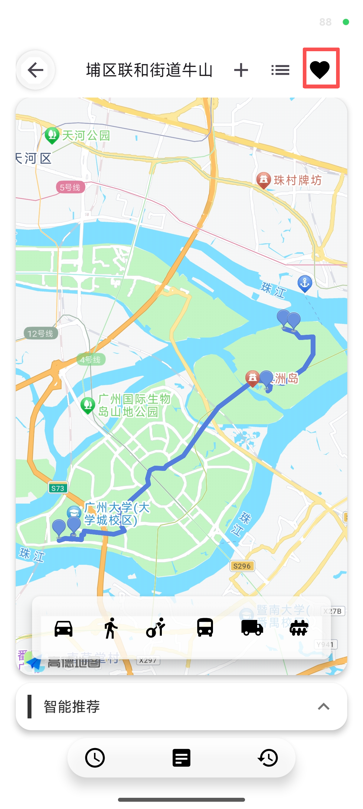 |

### 路线历史管理

<p align="center">
  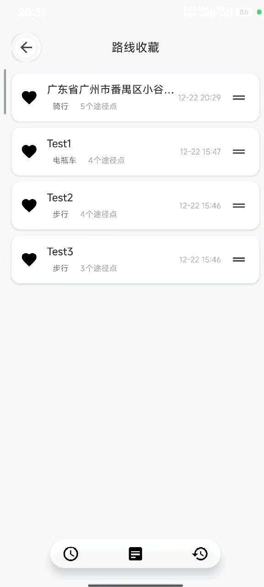
</p>

## 技术实现

- Android 原生 Java，Java 11
- Android Gradle Plugin 8.13.2
- compileSdk 36、targetSdk 36、minSdk 28
- 高德地图 Android SDK：地图、定位、搜索与路线规划
- Gson 2.10.1
- 最近邻启发式 TSP 排序，点间距离使用 Haversine 公式计算
- SharedPreferences 本地持久化路线记录

## 运行项目

### 1. 准备高德 SDK

本仓库不重新分发高德 SDK 的 JAR 和原生库。原项目使用的组合包版本为：

- AMap 3D Map 10.1.600
- AMap Navi 10.1.600
- AMap Search 9.7.4
- AMap Location 6.5.1

从[高德开放平台](https://lbs.amap.com/)下载兼容的 Android 组合包后：

1. 将 JAR 放到 `libs/AMap3DMap_10.1.600_AMapNavi_10.1.600_AMapSearch_9.7.4_AMapLocation_6.5.1_20251020.jar`。
2. 将 `arm64-v8a` 和 `armeabi-v7a` 原生库目录复制到 `app/src/main/jniLibs/`。

如下载包文件名不同，请同步修改 [app/build.gradle.kts](app/build.gradle.kts) 中的本地 JAR 路径。

### 2. 配置 API Key

在项目根目录的 `local.properties` 中保留 Android SDK 路径，并加入自己的高德 Key：

```properties
sdk.dir=C\:\\Users\\your-name\\AppData\\Local\\Android\\Sdk
AMAP_API_KEY=your_amap_api_key
```

Key 应在高德控制台中绑定本项目包名 `cn.edu.gzhu.amap` 和你的签名 SHA-1。不要提交 `local.properties`。

### 3. 构建

Windows：

```powershell
.\gradlew.bat assembleDebug
```

macOS / Linux：

```bash
./gradlew assembleDebug
```

调试 APK 输出在 `app/build/outputs/apk/debug/`。

## 项目结构

```text
app/src/main/java/cn/edu/gzhu/amap/
├── MainActivity.java                 # 地图浏览与图层控制
├── RouteRecommendationActivity.java # 地点、推荐与路线规划主流程
├── TspOptimizer.java                # 最近邻路径排序与距离计算
├── RouteStorageHelper.java          # 路线本地持久化
├── RouteHistoryActivity.java        # 收藏路线管理
└── overlay/                         # 各出行方式的路线覆盖物
```


## License

本项目源代码采用 [MIT License](LICENSE)。高德地图 SDK、地图数据与相关商标不属于本许可范围。
